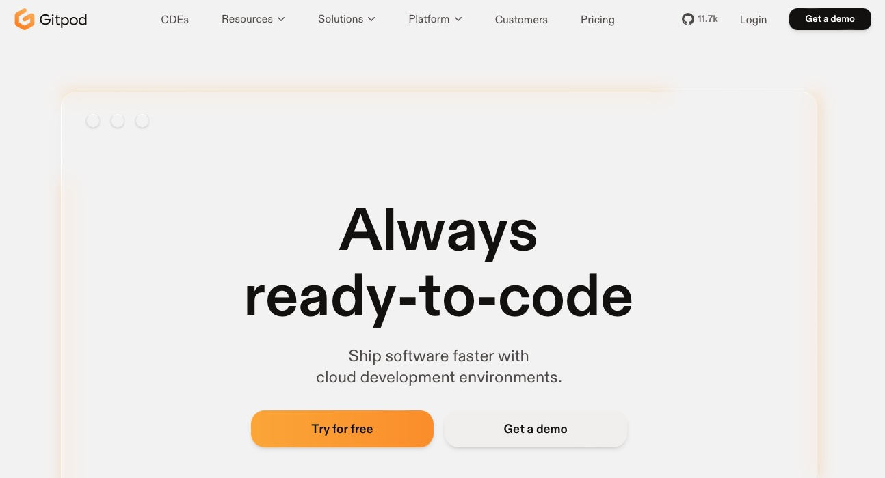
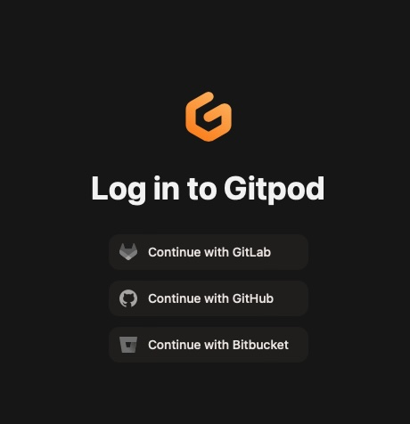
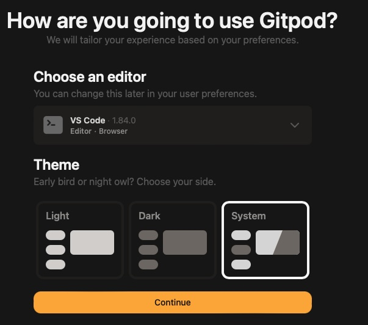
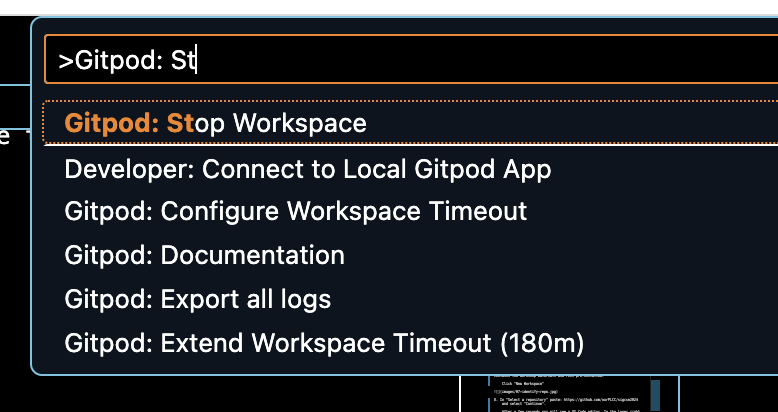
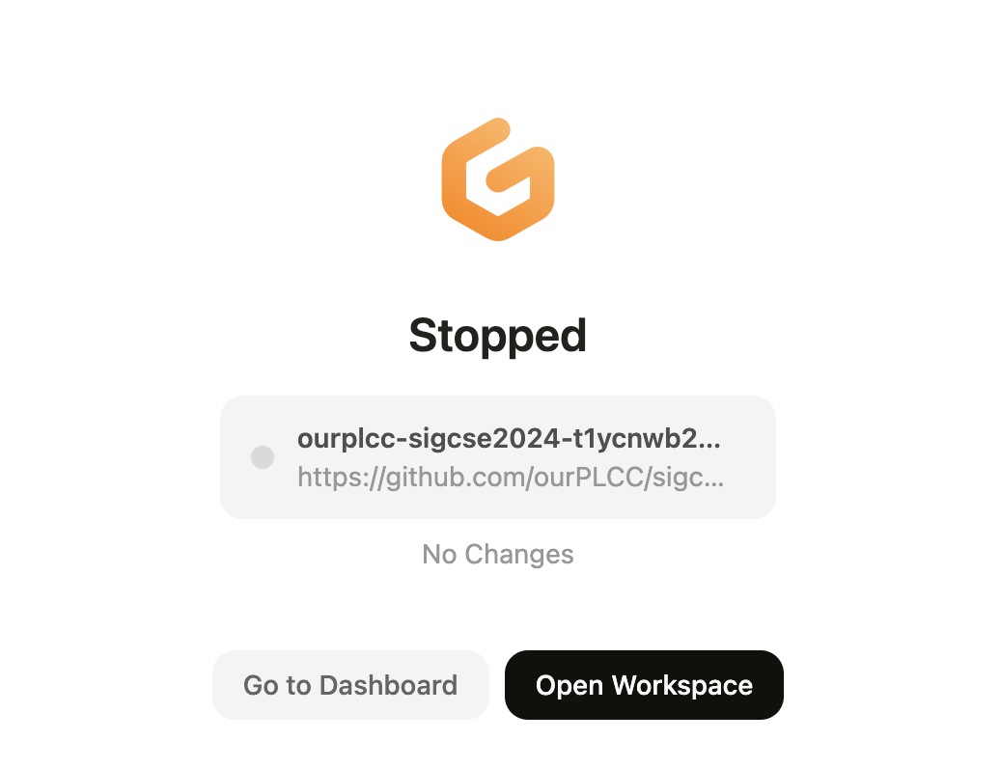

# Setup for the workshop

Please do your best to complete these instructions before attending
the workshop.

## Expected time

15-20 minutes

## Overview

Fear not! No prior experience with Git, GitHub, GitLab, BitBucket, or
GitPod is necessary for participating in this workshop. However, you
will need a GitPod account (which will require an account on GitHub,
GitLab, or BitBucket). The instructions on this page will walk you
through creating the necessary accounts and testing that you have access
to the workshop materials.

## GitHub, GitLab, or Bitbucket

These services store Git repositories and allow you to colloaborate with
others to build software. You'll need an account on at least one of these
to create a GitPod account in the next section. All provide free-tier accounts.
If you don't have one, please create one now; if you are having trouble
choosing, GitHub's account creation is pretty painless.

* <https://github.com/>
* <https://gitlab.com/>
* <https://bitbucket.com/>

Now that you have an account on one of these services continue on.

## LinkedIn

GitPod, which we'll set up next, giives you 10 free hours per month.
If you connect a LinkedIn account, they give you an additional 40 free
hours per month. If you don't have a LinkedIn account, and would like to
have this additional free time, you should create this account now.

Let's move on to creating a GitPod account.

## GitPod

GitPod provides effimeral workspaces for software development (similar
to GitHub's CodeSpaces). GitPod provides its users with 50 free computing
hours per month.

We will use it to provide you with a development environment, pre-installed
with PLCC and the workshop materials. Please complete the instructions
below to setup GitPod for use in this workshop.

## Create a GitPod Account 

1. Navigate to <https://gitpod.io/>. GitPod should greet you with something
like this.



2. Click "Try for free" and it'll provide you a choice of ways to create
an account.



3. Select the service with whome you have an account. GitPod will send you to that service to request authorization to read and write repositories in that service with your authority.


4. Authorize GitPod to act on your behalf in the service and you will
be redirected back to GitPod for configuration.


5. If you have a LinkedIn account, nows the time to
connect it to GitPod to get 50 free hours per month. Otherwise, you can continue with 10 free hours per
month.



6. Use the default configuration for editor. In particular, please
select "VS Code, Browser" for your editor. You can change this after
the workshop if you prefer.

    Next you'll be asked some survey questions. Answer them how you like.


7. When you continue you will be taken to your GitPod Dashboard.


8. Now let's confirm that you can start your personal workspace that
contains the workshop materials and PLCC pre-installed.

    Click "New Workspace"


9. In "Select a repository" paste: https://github.com/ourPLCC/sigcse2024
    and select "Continue".
    
    After a few seconds you will see a VS Code editor. In the lower right
    you will be asked if you want to open the workspace in VS Code
    Desktop?
    


10. Please close this by pressing the X in the dialog's upper-right corner. Please DO NOT press open.


11. Now try the following commands in the terminal in the bottom pane:

    ```bash
    java --version
    python --version
    plcc --version
    ```

    You should see something similar to the below, which means everthing
    is working.


12. You can now stop your workspace by pressing CTRL+SHIFT+P (CMD+SHIFT+P on Mac), search for and select "GitPod: Stop Workspace".



13. Once you see something like the following you can close the tab.



## Congratulations!

That's it! You are ready for the workshop!

## Help!

If you have any problems with the above, please contact Stoney Jackson <dr.stoney@gmail.com>.
